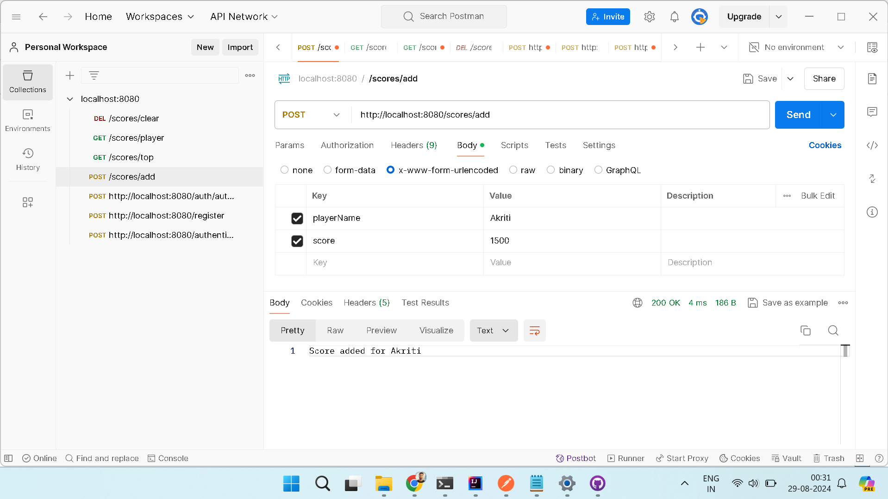

# Game Top Scores Application

## Overview

The Game Top Scores application is a Spring Boot-based microservice designed to manage and retrieve top scores for players in a game. This service uses Redis for efficient data storage and retrieval, ensuring high performance and scalability. The application includes functionalities for user registration, score recording, and retrieving top scores.

## Technology Stack

- **Spring Boot**: Provides a robust framework for building and deploying microservices, simplifying configuration and development.
- **Redis**: A high-performance in-memory data store used for managing player scores efficiently.
- **JWT (JSON Web Tokens)**: Used for secure authentication and authorization.
- **JUnit & Mockito**: For unit testing and mocking dependencies.

## Features

- User registration and authentication
- Record player scores
- Retrieve top scores

## Screenshots

### User Registration


### Add a player score




### Get Specific Player Score


### Clear All Scores


## Design Patterns

### 1. **Repository Pattern**
- **Description**: Abstracts data access and persistence logic.
- **Implementation**: `ScoreRepository` and `UserRepository` manage interactions with Redis, encapsulating data access logic.

### 2. **Service Pattern**
- **Description**: Encapsulates business logic and service layer functionality.
- **Implementation**: `ScoreServiceImpl` and `UserService` handle application-specific business logic and operations.

### 3. **Singleton Pattern**
- **Description**: Ensures a class has only one instance and provides a global point of access.
- **Implementation**: `JwtUtil` is a singleton component for managing JWT operations.

### 4. **DTO (Data Transfer Object) Pattern**
- **Description**: Transfers data between layers or over the network.
- **Implementation**: `PlayerScore` is used to transfer score data between the service and repository layers.

## Data Models

### User Model
```java
@Data
@AllArgsConstructor
@NoArgsConstructor
public class User {
    private String id;
    private String username;
    private String password;
}
```
- **Attributes**:
    - `id`: Unique identifier for the user.
    - `username`: User's login name.
    - `password`: User's hashed password.

### PlayerScore Model
```java
@Data
@AllArgsConstructor
@NoArgsConstructor
public class PlayerScore {
    private String playerName;
    private int score;
}
```
- **Attributes**:
    - `playerName`: Name of the player.
    - `score`: Player's score.

## Directory Structure

```
src/
│
├── main/
│   ├── java/
│   │   └── com/
│   │       └── example/
│   │           └── gametopscores/
│   │               ├── config/              # Configuration classes
│   │               ├── controller/          # REST API controllers
│   │               ├── model/               # Data models
│   │               ├── repository/          # Data access layers
│   │               └── service/             # Business logic
│   └── resources/
│       ├── application.properties            # Application properties
│
└── test/
    └── java/
        └── com/
            └── example/
                └── gametopscores/
                    ├── service/             # Unit tests for services
                    └── controller/          # Unit tests for controllers
```

## Running the Application Locally

1. **Clone the Repository:**
   ```bash
   git clone https://github.com/yourusername/gametopscores.git
   cd gametopscores
   ```

2. **Configure Application Properties:**
   Update `src/main/resources/application.properties` with your Redis and JWT settings.

3. **Build and Run:**
   Ensure you have JDK 11 or higher and Maven installed.
   ```bash
   ./mvnw clean install
   ./mvnw spring-boot:run
   ```

4. **Start Redis Server:**
   Ensure Redis server is running on default port `6379`.

## Testing APIs with Postman

1. **Register User:**
    - **Method**: POST
    - **URL**: `http://localhost:8080/register`
    - **Body** (JSON):
      ```json
      {
        "username": "testuser",
        "password": "password"
      }
      ```

2. **Authenticate User:**
    - **Method**: POST
    - **URL**: `http://localhost:8080/authenticate`
    - **Body** (JSON):
      ```json
      {
        "username": "testuser",
        "password": "password"
      }
      ```

3. **Record Player Score:**
    - **Method**: POST
    - **URL**: `http://localhost:8080/scores`
    - **Headers**:
        - `Authorization: Bearer <JWT_TOKEN>`
    - **Body** (JSON):
      ```json
      {
        "playerName": "testuser",
        "score": 150
      }
      ```

4. **Get Top Scores:**
    - **Method**: GET
    - **URL**: `http://localhost:8080/scores`
    - **Headers**:
        - `Authorization: Bearer <JWT_TOKEN>`


